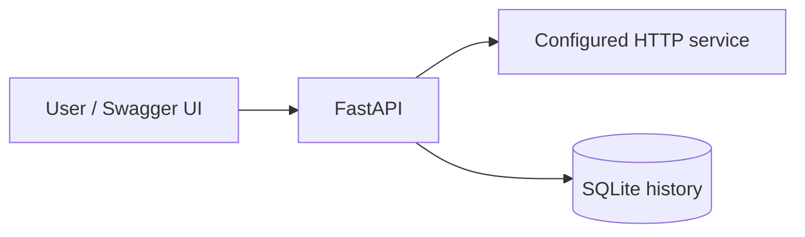

# CloudOps Lab

A small HTTP availability monitor built with Python, FastAPI, SQLite and Docker. It checks a configured URL and stores the result and response time for later inspection.

## Current scope

- Run an on-demand check against one target configured by the operator.
- Store HTTP status, time to response headers, UTC timestamp and network failures.
- Read persistent check history, newest first.
- Run the API as a non-root container, exposed only on localhost.

Checks are currently manual. Scheduled monitoring, dashboards and AWS deployment are planned additions.



## Quick start with Docker

Requires Docker Desktop running with Linux containers, or Docker Engine with Compose on Linux.

```sh
docker compose up --build -d
```

Open http://localhost:8000/docs. Under **POST /checks**, select **Try it out**, then **Execute**. Use **GET /checks** to view history and **GET /health** to check API liveness.

The default target is `https://example.com`. To change it, copy `.env.example` to `.env`, edit `TARGET_URL`, then run `docker compose up -d` again. Use a trusted target that you are authorized to monitor, without credentials or sensitive tokens in its URL.

```sh
docker compose logs -f api
docker compose down
```

The named volume retains history after `down`. Adding `--volumes` removes that history.

## Run locally with Python

Requires Python 3.12+.

```sh
python -m venv .venv
```

Activate the environment using `.venv\Scripts\Activate.ps1` in PowerShell or `source .venv/bin/activate` on Linux/macOS, then:

```sh
python -m pip install -r requirements-dev.txt
python -m uvicorn app.main:app --host 127.0.0.1 --port 8000
```

The SQLite database is created in `data/checks.db`. For direct Python execution, set `TARGET_URL` and optionally `DATABASE_PATH` as shell environment variables; `.env` is only loaded automatically by Compose.

## API

| Method | Path | Behaviour |
| --- | --- | --- |
| GET | `/health` | API liveness, independent of target availability |
| POST | `/checks` | Run and persist one check; returns HTTP 201 even when the target is down |
| GET | `/checks?limit=20` | Latest checks, with a limit from 1 to 100 |
| GET | `/docs` | Interactive API documentation |

HTTP 200–399 is classified as `up`; other final HTTP statuses and network errors are `down`. Redirects are recorded without being followed. Latency measures time until response headers, including client setup; response bodies are not downloaded. HTTPX timeouts are set to five seconds per network operation, not a five-second total deadline. TLS certificate verification stays enabled, and proxy settings from the environment are ignored.

## Tests

```sh
python -m pytest -q
```

Tests use simulated HTTP responses and temporary databases. They cover successful and failing statuses, redirects, timeouts, connection errors, persistence across restarts, history ordering and invalid input. No public website or AWS account is needed.

The GitHub Actions workflow runs the tests, validates the Compose configuration and builds the Docker image on pushes and pull requests. It can also be started manually from the Actions tab.

## Boundaries and next milestones

The API runs locally and has no authentication or rate limiting. Do not expose it publicly in this form. The target URL is set through environment configuration, not API input. SQLite history has no retention policy yet.

1. Add scheduled checks and structured logs.
2. Add vulnerability and secret scanning to CI.
3. Provision AWS infrastructure with Terraform after reviewing costs and access controls.
4. Add metrics, alerts and a documented recovery exercise.

No AWS resources are provisioned by this repository at this stage.

## Design references

- [FastAPI container deployment](https://fastapi.tiangolo.com/deployment/docker/)
- [HTTPX timeout behaviour](https://www.python-httpx.org/advanced/timeouts/)
