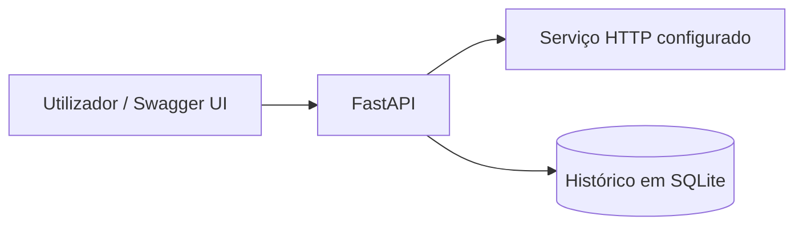

# CloudOps Lab

Um pequeno monitor de disponibilidade HTTP desenvolvido com Python, FastAPI, SQLite e Docker. Verifica um URL configurado e guarda o resultado e o tempo de resposta para consulta posterior.

## Funcionalidades atuais

- Verificação, a pedido, de um serviço definido na configuração.
- Registo do código de estado HTTP, do tempo até à receção dos cabeçalhos, da data e hora em UTC e de eventuais falhas de rede.
- Consulta do histórico persistente, com as verificações mais recentes em primeiro lugar.
- Execução da API num contentor sem privilégios de administrador, acessível apenas através de `localhost`.

As verificações são atualmente manuais. Estão previstas a monitorização periódica, a criação de painéis e a disponibilização da aplicação na AWS.



## Arranque com Docker

É necessário ter o Docker Desktop em execução, com contentores Linux, ou o Docker Engine com Compose num sistema Linux.

```sh
docker compose up --build -d
```

Abrir <http://localhost:8000/docs>. Na operação **POST /checks**, selecionar **Try it out** e, de seguida, **Execute**. Utilizar **GET /checks** para consultar o histórico e **GET /health** para confirmar que a API está ativa.

O URL predefinido é `https://example.com`. Para o alterar, copiar `.env.example` para `.env`, modificar `TARGET_URL` e executar novamente `docker compose up -d`. O serviço escolhido deve ser de confiança e a sua monitorização deve estar autorizada. O URL não deve conter credenciais nem tokens sensíveis.

Para acompanhar os registos da aplicação:

```sh
docker compose logs -f api
```

Para parar e remover os contentores:

```sh
docker compose down
```

O volume mantém o histórico após a execução de `down`. A opção `--volumes` elimina esse volume e os dados nele guardados.

## Execução local com Python

É necessário Python 3.12 ou superior.

```sh
python -m venv .venv
```

Ativar o ambiente virtual com `.venv\Scripts\Activate.ps1` no PowerShell ou `source .venv/bin/activate` em Linux/macOS. De seguida, executar:

```sh
python -m pip install -r requirements-dev.txt
python -m uvicorn app.main:app --host 127.0.0.1 --port 8000
```

A base de dados SQLite é criada em `data/checks.db`. Na execução direta com Python, `TARGET_URL` e, opcionalmente, `DATABASE_PATH` devem ser definidos como variáveis de ambiente no terminal. O ficheiro `.env` só é carregado automaticamente pelo Compose.

## API

| Método | Caminho | Funcionamento |
| --- | --- | --- |
| GET | `/health` | Confirma que a API está ativa, independentemente da disponibilidade do serviço monitorizado |
| POST | `/checks` | Executa e guarda uma verificação; devolve HTTP 201 mesmo quando o serviço está indisponível |
| GET | `/checks?limit=20` | Devolve as verificações mais recentes, com um limite entre 1 e 100 |
| GET | `/docs` | Apresenta a documentação interativa da API |

As respostas HTTP de 200 a 399 são classificadas como `up`. Os restantes códigos de resposta finais e os erros de rede são classificados como `down`. Os redirecionamentos são registados, mas não são seguidos.

A latência mede o tempo até à receção dos cabeçalhos da resposta, incluindo a preparação do cliente HTTP. O corpo da resposta não é descarregado. O HTTPX tem um tempo limite de cinco segundos por operação de rede; este valor não corresponde a um limite total de cinco segundos para toda a verificação. A validação dos certificados TLS mantém-se ativa e as definições de proxy do ambiente são ignoradas.

## Testes

```sh
python -m pytest -q
```

Os testes utilizam respostas HTTP simuladas e bases de dados temporárias. Abrangem respostas de sucesso e de erro, redirecionamentos, tempos limite, erros de ligação, persistência após reinícios, ordenação do histórico e dados de entrada inválidos. Não é necessário aceder a um site público nem ter uma conta AWS.

O fluxo de integração contínua no GitHub Actions executa os testes, valida a configuração do Compose e constrói a imagem Docker a cada envio de alterações (*push*) e em pedidos de integração (*pull requests*). Também pode ser iniciado manualmente no separador **Actions**.

## Limitações e próximos passos

A API funciona localmente e ainda não tem autenticação nem limitação da frequência dos pedidos. Nesta fase, não deve ser exposta publicamente. O URL monitorizado é definido na configuração do ambiente, não através de pedidos à API. O histórico em SQLite ainda não tem uma política de retenção.

1. Acrescentar verificações periódicas e registos estruturados.
2. Integrar a deteção de vulnerabilidades e de credenciais expostas no processo de integração contínua.
3. Criar a infraestrutura AWS com Terraform, após analisar os custos e os controlos de acesso.
4. Acrescentar métricas, alertas e um exercício documentado de recuperação de falhas.

Nesta fase, o repositório não cria recursos na AWS.

## Referências técnicas

- [Execução do FastAPI em contentores](https://fastapi.tiangolo.com/deployment/docker/)
- [Funcionamento dos tempos limite no HTTPX](https://www.python-httpx.org/advanced/timeouts/)
